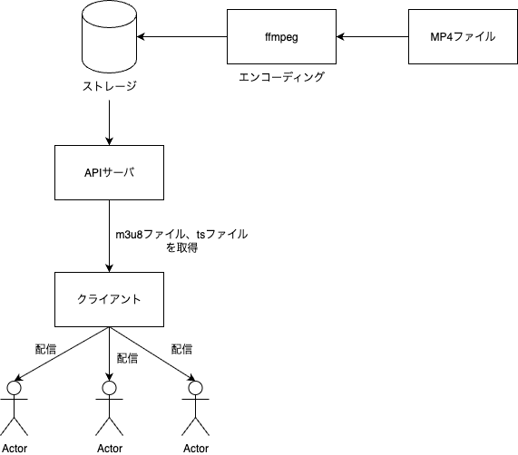

## ディレクトリ構成
```
.
├── Pipfile
├── Pipfile.lock
├── main.py
├── readme.md
├── schedule.json
├── start_server.py
└── static
    └── index.html
    └── stream
       └── 番組名
            ├── video.m3u8
            ├── video000.ts
            ├── video001.ts
            ├── .
            ├── .
            └── .
```
## 操作
1. schedule.jsonを記入
    ```
    [
        { 
            "start_time": "ラジオ開始時間(ISOフォーマット)",
            "duration_sec": ラジオの時間,
            "type": "VOD", #ビデオの種類 VOD or LIVE 
            "path_template": "static/stream/番組名/video{}.ts"
        },
    ]
    ```
2. ***uvicorn main:app*** でAPIサーバーを起動
3. http://127.0.0.1:8000/static/index.html にアクセス
## 構成図

